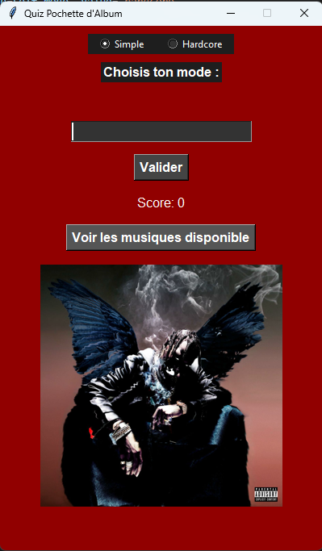

# RAP US Quiz Python - Version Beta 0.1.3

Quiz pour deviner le nom des musiques à partir de leur pochette et d’un extrait audio.

Avec des musiques comme Travis Scott et Metro Boomin.

---
## Améliorations possibles dans le futur

Ajout de nouvelles musiques

---
## Installation

Python 3 est obligatoire.

Installez les dépendances avec pip dans un terminal vscode :

```bash
pip install pygame pillow

```
---





